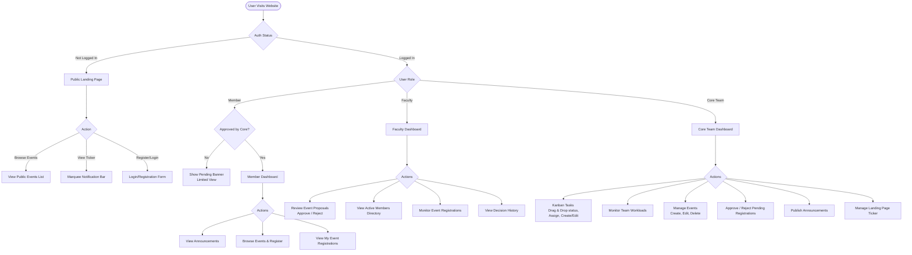
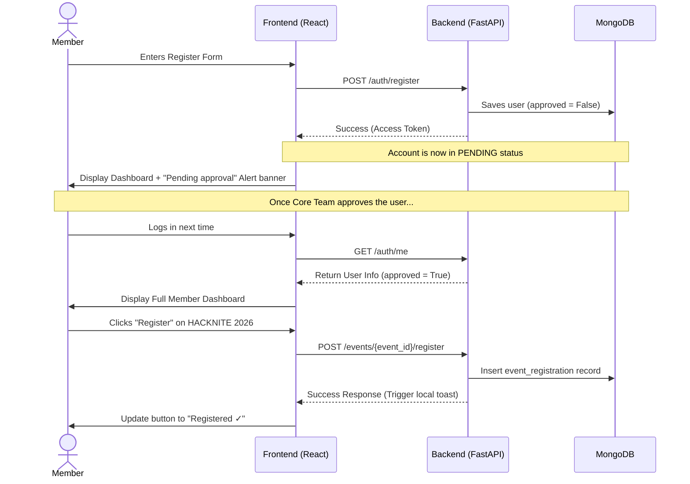
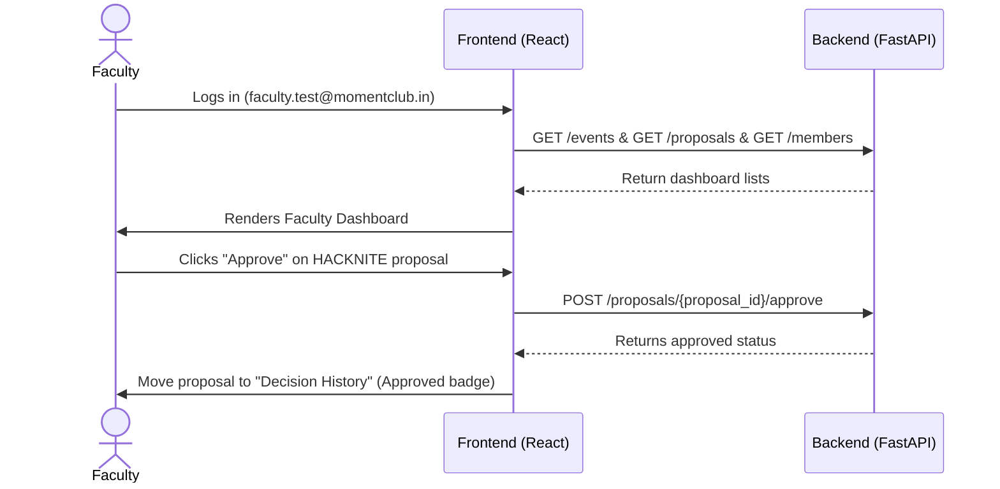
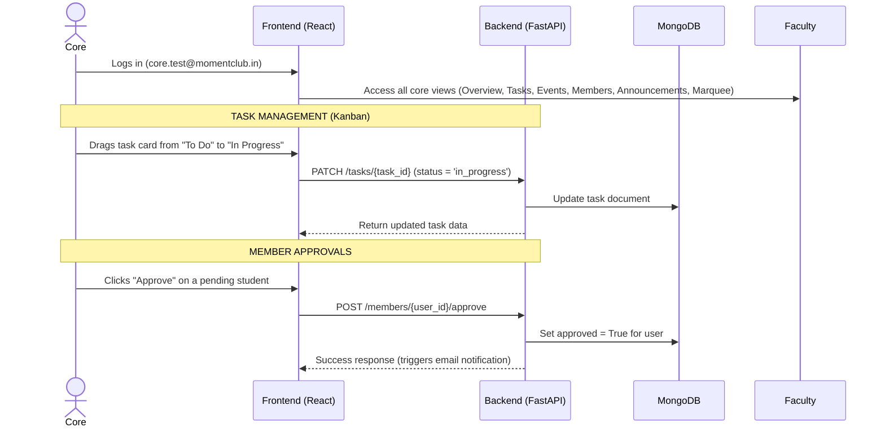

# 📋 User Flows and Permissions

This document outlines the user flows, dashboards, and permission levels for the three primary roles in **The Moment Club** Management System: **Member**, **Faculty**, and **Core Team**.

---

## 🔑 Role & Permission Summary

| Feature | Member | Faculty | Core Team |
| :--- | :---: | :---: | :---: |
| **View Announcements & Marquee** | ✅ | ✅ | ✅ |
| **Register for Events** | ✅ | ❌ | ❌ |
| **Submit Event Proposals** | ❌ | ❌ | ✅ |
| **Approve / Reject Proposals** | ❌ | ✅ | ❌ |
| **Create/Update/Delete Events** | ❌ | ❌ | ✅ |
| **Manage Tasks (Kanban Board)** | ❌ | ❌ | ✅ |
| **View Member Directory** | ❌ | ✅ | ✅ |
| **Approve/Reject New Members** | ❌ | ❌ | ✅ |
| **Manage Ticker/Marquee Messages** | ❌ | ❌ | ✅ |

---

## 🗺️ High-Level User Flow Diagram

---

## 👤 1. Member User Flow

The member flow is focused on participants who attend hackathons, workshops, and tech talks.

### Key Activities for Members:
1. **Self-Registration & Status Check**: Register with name, email, department, student ID, and password. View a banner displaying whether the membership request has been approved or is still pending.
2. **Dashboard Overview**: Access a clean overview showing metrics for upcoming events, personal registrations, active announcements, and registration status.
3. **Register for Events**: Browse available club events (Hackathons, Workshops, Conferences) and register instantly. Registered events display a green `Registered` badge.
4. **Announcements Feed**: Read official club announcements published by Faculty or the Core Team.

---

## 🎓 2. Faculty User Flow

The faculty flow is designed for professors and department heads who oversee and sponsor club activities.

### Key Activities for Faculty:
1. **Overview Dashboard**: Access aggregated metrics: total active events, pending proposals, total approved club members, and decisions made.
2. **Approve / Reject Event Proposals**: Core team members submit proposals for events. Faculty can review titles, descriptions, and proposers, then approve or reject them directly.
3. **Monitor Event Registrations**: View a list of current events alongside the registration count for each.
4. **Member Directory**: Inspect the list of registered student members and check their status (Active or Pending).
5. **Decision History**: Track past proposal approvals/rejections with timestamps.

---

## ⚡ 3. Core Team User Flow

The core team flow represents full administrative capabilities to drive and manage all club operations.

### Key Activities for Core Team:
1. **Centralized Hub Overview**: Track open/done tasks, upcoming events, and pending member applications at a glance.
2. **ClickUp-Style Kanban Task Board**:
   - Organize workloads across four columns: `To Do`, `In Progress`, `Review`, and `Done`.
   - Update task status by dragging cards between columns.
   - Create, edit, and delete tasks. Assign tasks to core team members or faculty mentors, and set due dates and priorities (`Urgent`, `High`, `Medium`, `Low`).
3. **Team Workload Tracker**: Monitor team members' workload (view open vs. completed tasks for each core member).
4. **Event Management**: Create, edit, and delete events. Add cover images, set category tags, capacity limits, and prize pools. Once an event finishes, record winners and event photos.
5. **Member Approvals**: View all pending requests, approve students to make them active members, or reject and delete unapproved applications.
6. **Announcements Publisher**: Write and publish club announcements.
7. **Marquee / Ticker Editor**: Manage the dynamic notification ticker that scrolls across the public homepage header.
